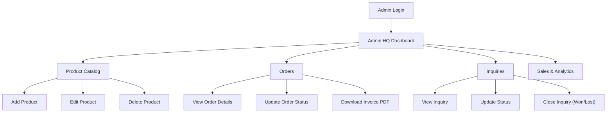
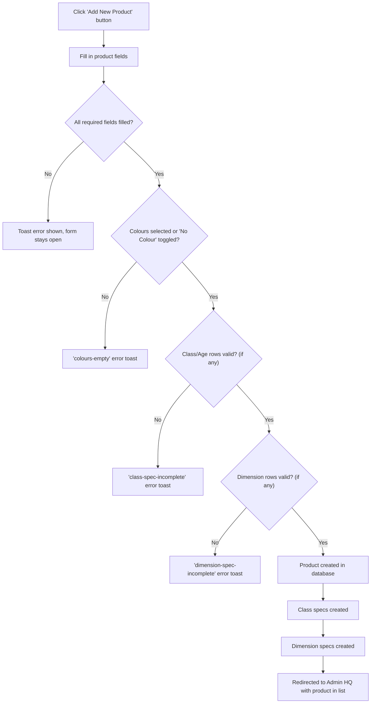
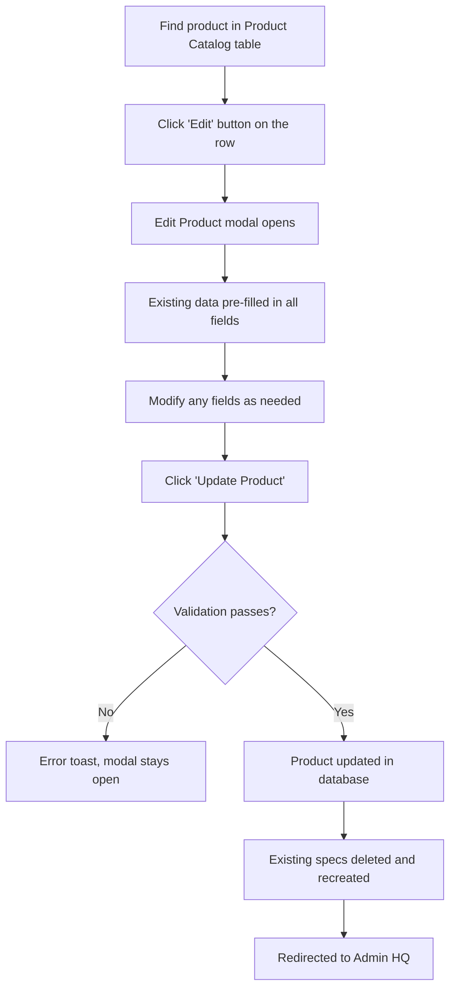
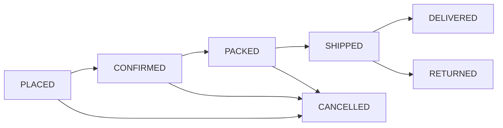
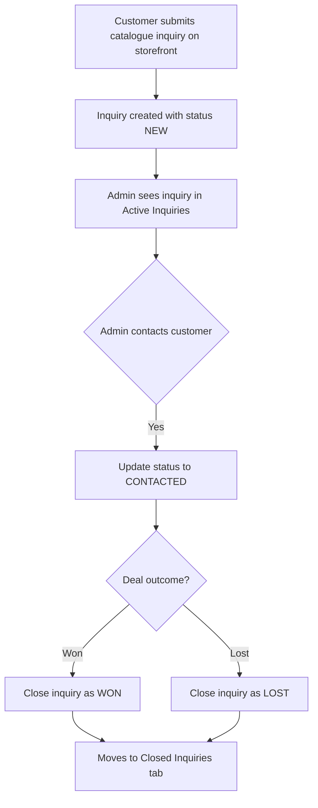
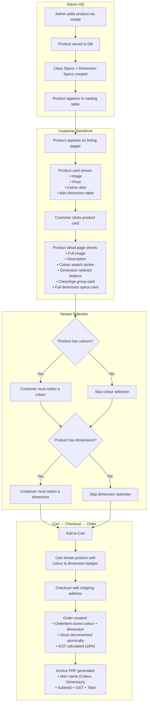

# 🛡️ A kids Enterprise — Admin HQ Manual

> **Version**: 1.0 · **Last Updated**: 2 August 2026  
> **Audience**: Platform administrators operating the **Admin HQ** dashboard  
> **Platform URL**: `https://akidsenterprise.com/admin-panel/`

---

## Table of Contents

1. [Getting Started](#1-getting-started)
2. [Admin HQ Overview](#2-admin-hq-overview)
3. [Product Catalog Management](#3-product-catalog-management)
   - 3.1 [Adding a New Product](#31-adding-a-new-product)
   - 3.2 [Field-by-Field Guide](#32-field-by-field-guide)
   - 3.3 [Colours & Variants](#33-colours--variants)
   - 3.4 [Class / Age Group Specs](#34-class--age-group-specs)
   - 3.5 [Dimension Specs](#35-dimension-specs)
   - 3.6 [Real-World Product Examples](#36-real-world-product-examples)
   - 3.7 [Editing a Product](#37-editing-a-product)
   - 3.8 [Deleting a Product](#38-deleting-a-product)
4. [Order Management](#4-order-management)
5. [Inquiry Management](#5-inquiry-management)
6. [Sales & Analytics](#6-sales--analytics)
7. [Product Flow — From Admin to Customer](#7-product-flow--from-admin-to-customer)
8. [Admin Authentication & Security](#8-admin-authentication--security)
9. [Troubleshooting & FAQs](#9-troubleshooting--faqs)

---

## 1. Getting Started

### Login

1. Navigate to **`/login/`** or **`/admin-panel/`**.
2. Enter your admin **email** and **password** (configured via `ADMIN_EMAIL` / `ADMIN_PASSWORD` environment variables).
3. You will be redirected to the **Admin HQ** dashboard.

> [!IMPORTANT]
> Admin accounts are created via the `create_admin_from_env` management command. Contact your system administrator if you cannot log in.

### Navigation

The Admin HQ is a **single-page dashboard** with a sidebar menu on the left:

| Menu Item | Description |
|-----------|-------------|
| **Product Catalog** | View, add, edit, and delete products |
| **Orders** | Manage customer orders and update statuses |
| **Inquiries** | Respond to customer catalog quote requests |
| **Closed Inquiries** | Review completed inquiry records |
| **Sales & Analytics** | View revenue charts and business metrics |

---

## 2. Admin HQ Overview

The dashboard banner displays:
- **Your admin email** (logged-in identity)
- **"Add New Product"** button (quick access)
- **"Sign Out"** button

---

## 3. Product Catalog Management

### 3.1 Adding a New Product

**Steps:**

1. Click the **"+ Add New Product"** button in the Dashboard Banner.
2. The **Add New Product** modal opens.
3. Fill in the form fields (see [Field-by-Field Guide](#32-field-by-field-guide) below).
4. Click **"Save Product"**.
5. On success, you are redirected back to the Product Catalog tab.

---

### 3.2 Field-by-Field Guide

| Field | Required | Type | What to Enter | Example |
|-------|----------|------|---------------|---------|
| **Product Name** | ✅ Yes | Text | The full product name exactly as it appears in the catalogue | `School Desk – Wooden Top` |
| **SKU** | ❌ No | Text | Product code from the catalogue (e.g., `LF 7021`, `PE 2026`) | `LF 7021` |
| **Category** | ✅ Yes | Dropdown | Select one: `Indoors`, `Outdoors`, `Parts`, `Shreem Sports` | `Indoors` |
| **Price (₹)** | ✅ Yes | Number | Base price in INR without tax (the system adds 18% GST automatically) | `8500` |
| **Stock** | ✅ Yes | Number | Available units. Defaults to `10` | `25` |
| **Image URL** | ❌ No | URL | Paste a direct image link. Google Drive share links are auto-converted. Falls back to a default image if blank | `https://drive.google.com/file/d/...` |
| **Available Colours** | ✅ Yes | Swatch picker | Click colour swatches to select. If product has no colour variants, click **"No Colour"** | Click `Red`, `Blue`, `Green` |
| **Class / Age Group** | ❌ No | Table rows | Add rows with class label and age range (see [§3.4](#34-class--age-group-specs)) | `PRE` / `3` / `5` |
| **Dimensions** | ❌ No | Table rows | Add rows with component, L×W×H, unit, notes (see [§3.5](#35-dimension-specs)) | `Desk` / `60` / `45` / `59-90` / `cm` |
| **Description** | ✅ Yes | Textarea | Describe materials, safety specs, features. This appears on the storefront product page | `Wooden top desk with adjustable...` |

> [!TIP]
> **Google Drive Images**: You can paste a Google Drive **sharing link** directly — the system automatically converts it to a direct display URL.

---

### 3.3 Colours & Variants

The colour system offers **14 predefined colour swatches**:

| Colour | Hex | Colour | Hex |
|--------|-----|--------|-----|
| Red | `#E53935` | Pink | `#EC407A` |
| Blue | `#1E88E5` | Black | `#000000` |
| Green | `#43A047` | White | `#FFFFFF` |
| Yellow | `#FDD835` | Gray | `#9E9E9E` |
| Orange | `#FB8C00` | Brown | `#6D4C41` |
| Purple | `#8E24AA` | Sky Blue | `#29B6F6` |
| Maroon | `#800000` | Teal | `#00897B` |

**How to use:**
- **Click swatches** to select available colours for the product. Selected swatches show a ✓ checkmark.
- If the product has **no colour variants** (e.g., a metal swing set), click the **"No Colour"** button. This disables all swatches.
- You **must** either select at least one colour **or** toggle "No Colour" — leaving both empty will show an error.

**On the storefront:**
- Selected colours appear as clickable swatch dots on product cards and the product detail page.
- Customers must select a colour before adding to cart.
- The chosen colour is captured in the order and printed on the invoice.

---

### 3.4 Class / Age Group Specs

The Class/Age Group table defines which school standard and age range the product is suitable for.

| Column | Required | What to Enter | Example Values |
|--------|----------|---------------|----------------|
| **Class** | ✅ Yes (per row) | The school standard or classification name | `PRE`, `NUR`, `LKG/UKG`, `PRIMARY`, `MIDDLE`, `HIGH` |
| **Age Min (Years)** | ✅ Yes (per row) | Minimum age in whole years | `1`, `3`, `6`, `11` |
| **Age Max (Years)** | ✅ Yes (per row) | Maximum age in whole years | `3`, `5`, `10`, `14` |

**Rules:**
- All three fields (Class, Age Min, Age Max) are required for every row.
- Age Min must be ≤ Age Max.
- Age Min must be ≥ 0.
- Click **"+ Add Class Row"** to add additional rows.
- Click the **🗑️ delete button** on a row to remove it.
- This section is **optional** — leave it empty if the product is not age-specific.

**Standard classifications from catalogues:**

| Class Label | Age Range | Typical Products |
|-------------|-----------|------------------|
| PRE | 1–3 years | Toddler chairs, small play tables |
| NUR | 3–5 years | Nursery desks, small benches |
| LKG/UKG | 3–6 years | Kindergarten furniture |
| PRIMARY | 6–11 years | School desks, benches, lockers |
| MIDDLE | 11–14 years | Larger desks, lab furniture |
| HIGH | 14+ years | Full-size desks, conference tables |

---

### 3.5 Dimension Specs

The Dimension Specs table captures physical measurements for each product component.

| Column | Required | What to Enter | Example Values |
|--------|----------|---------------|----------------|
| **Group Label** | ❌ No | Groups dimensions visually — typically the class/standard this size belongs to | `PRIMARY`, `MIDDLE`, `HIGH`, `Standard` |
| **Component** | ❌ No | The physical component being measured (for multi-piece products) | `Desk`, `Chair`, `Table Top`, `Diameter` |
| **Length** | ✅ Yes | Primary dimension. Can be a number, range, or text | `120`, `59-90`, `D/Dia 90` |
| **Width** | ❌ No | Secondary dimension. Leave blank for circular/single-dimension items | `60`, `45`, `` |
| **Height** | ❌ No | Third dimension. Leave blank for flat items or when height is N/A | `75`, `59-90`, `` |
| **Unit** | ✅ Yes | Measurement unit dropdown | `cm` (default), `inch`, `mm`, `ft` |
| **Notes** | ❌ No | Additional context (e.g., capacity, material note) | `60 Ltrs`, `Adjustable`, `With Armrest` |

**Rules:**
- **Length is mandatory** for every non-empty dimension row.
- Width and Height are optional — leave blank for items where they don't apply.
- All dimension fields are **text** (not numeric), so you can enter ranges like `59-90` or descriptions like `D/Dia 90`.
- Click **"+ Add Dimension Row"** to add rows.
- Click the **🗑️ delete button** on a row to remove it.
- This section is **optional** — leave it empty if dimensions are not relevant.

> [!IMPORTANT]
> **Circular Items**: For circular products (tables, dustbins, etc.), put the diameter value in the **Length** field (e.g., `D/Dia 90`), set **Component** to `Diameter`, and leave Width blank.

> [!TIP]
> **Adjustable Heights**: For products with adjustable heights (like school desks), enter the range in the Height field (e.g., `59-90`).

---

### 3.6 Real-World Product Examples

Below are real examples from the A kids catalogues showing exactly how to fill in the admin form.

#### Example 1: School Desk + Chair Set (Indoor — LF 7021)

A desk-and-chair combo with multiple class sizes and components.

**Basic Fields:**
| Field | Value |
|-------|-------|
| Product Name | `Wooden Top School Desk With Shelf & Metal Chair Set` |
| SKU | `LF 7021` |
| Category | `Indoors` |
| Price (₹) | `8500` |
| Colours | Select: `Blue`, `Green`, `Red`, `Yellow` |

**Class / Age Group Table:**

| Class | Age Min | Age Max |
|-------|---------|---------|
| PRE | 1 | 3 |
| NUR | 3 | 5 |
| LKG/UKG | 3 | 6 |
| PRIMARY | 6 | 11 |
| MIDDLE | 11 | 14 |
| HIGH | 14 | 18 |

**Dimension Specs Table:**

| Group Label | Component | Length | Width | Height | Unit | Notes |
|-------------|-----------|--------|-------|--------|------|-------|
| PRE | Desk | 60 | 45 | 59-90 | cm | |
| PRE | Chair | 30 | 27 | 52 | cm | |
| NUR | Desk | 60 | 45 | 59-90 | cm | |
| NUR | Chair | 30 | 27 | 55 | cm | |
| PRIMARY | Desk | 60 | 45 | 59-90 | cm | |
| PRIMARY | Chair | 35 | 32 | 65 | cm | |
| MIDDLE | Desk | 60 | 45 | 71-90 | cm | |
| MIDDLE | Chair | 38 | 35 | 71 | cm | |

---

#### Example 2: Round Table (Indoor — LF 0431)

A circular table product with diameter instead of L×W.

**Basic Fields:**
| Field | Value |
|-------|-------|
| Product Name | `Round Table – Wooden Top` |
| SKU | `LF 0431` |
| Category | `Indoors` |
| Price (₹) | `6200` |
| Colours | Select: `Red`, `Blue`, `Green`, `Yellow` |

**Dimension Specs Table:**

| Group Label | Component | Length | Width | Height | Unit | Notes |
|-------------|-----------|--------|-------|--------|------|-------|
| Standard | Diameter | D/Dia 90 | | 50 | cm | |

---

#### Example 3: Outdoor Multi-Play System (Outdoor — PE 2026)

An outdoor play system — typically no individual components, single overall dimension.

**Basic Fields:**
| Field | Value |
|-------|-------|
| Product Name | `Multi-Play System – Jungle Gym` |
| SKU | `PE 2026` |
| Category | `Outdoors` |
| Price (₹) | `185000` |
| Colours | Click **"No Colour"** (metal equipment, colour N/A) |

**Dimension Specs Table:**

| Group Label | Component | Length | Width | Height | Unit | Notes |
|-------------|-----------|--------|-------|--------|------|-------|
| | | 500 | 400 | 350 | cm | Overall footprint |

---

#### Example 4: Storage Rack (Indoor — Simple product)

A product with no class specs and a single dimension row.

**Basic Fields:**
| Field | Value |
|-------|-------|
| Product Name | `Open Storage Rack – 6 Compartments` |
| SKU | `LF 0602` |
| Category | `Indoors` |
| Price (₹) | `4800` |
| Colours | Select: `Brown`, `White` |

**Dimension Specs Table:**

| Group Label | Component | Length | Width | Height | Unit | Notes |
|-------------|-----------|--------|-------|--------|------|-------|
| | | 90 | 30 | 120 | cm | |

---

### 3.7 Editing a Product

**Steps:**
1. In the **Product Catalog** tab, find the product row.
2. Click the **pencil/edit icon** button on the row.
3. The **Edit Product** modal opens with all existing data pre-filled:
   - Name, category, price, stock, image URL, description
   - Colour swatches reflect current selections
   - Class/Age Group rows are populated from existing specs
   - Dimension rows are populated from existing specs
4. Modify any fields.
5. Click **"Update Product"**.

> [!NOTE]
> When saving edits, **all existing class specs and dimension specs are deleted and recreated** from the form data. This is by design — it simplifies reordering and modification.

---

### 3.8 Deleting a Product

1. In the **Product Catalog** tab, find the product row.
2. Click the **🗑️ delete** button.
3. Confirm the deletion in the browser prompt.
4. The product is permanently removed from the database.

> [!CAUTION]
> **Deletion is permanent.** There is no undo. Deleting a product also removes all its class specs, dimension specs, and inquiry associations.

---

## 4. Order Management

### Order Status Transitions

| Current Status | Can Transition To |
|----------------|-------------------|
| PLACED | CONFIRMED, CANCELLED |
| CONFIRMED | PACKED, CANCELLED |
| PACKED | SHIPPED, CANCELLED |
| SHIPPED | DELIVERED, CANCELLED, RETURNED |
| DELIVERED | RETURNED |
| CANCELLED | *(terminal — no further changes)* |
| RETURNED | *(terminal — no further changes)* |

### Order Table Columns

The Orders tab shows a compact 9-column table:

| Column | Description |
|--------|-------------|
| Order No | Sequential order ID (e.g., `ORD-00001`) |
| Customer | Customer name (truncated, hover for full) |
| Shipping Address | Delivery address (truncated, hover for full) |
| Products | Product names × quantities |
| Total | Total amount with GST (₹) |
| Status | Current order status badge |
| Actions | Status update dropdown |
| Order Date | When the order was placed |
| Bills | View Details / Download Invoice PDF |

### Actions Available

1. **Change Status**: Use the dropdown to transition orders through the status pipeline.
2. **View Order Detail**: Click "Detail" to see the full order breakdown.
3. **Download Invoice PDF**: Click "Invoice" to generate and download a PDF invoice showing:
   - Customer details, shipping address
   - Line items with product name, colour, dimension, quantity, unit price
   - Subtotal (GST-exclusive), 18% GST breakdown, total payable

---

## 5. Inquiry Management

### Active Inquiries Tab

| Column | Description |
|--------|-------------|
| Inquiry No | Sequential ID (e.g., `INQ-0001`) |
| Customer Name | Who submitted the inquiry |
| Contact Number | Phone number |
| Products Requested | List of product codes and names |
| Quantity | Requested quantity |
| Module | Indoor / Outdoor / Shreem Sports |
| Status | NEW or CONTACTED |
| Created Date | When received |
| Actions | Update status, view details |

### Inquiry Workflow

### Inquiry Statuses

| Status | Meaning |
|--------|---------|
| **NEW** | Just received, not yet reviewed |
| **CONTACTED** | Admin has reached out to the customer |
| **CLOSED** | Final — closed as either WON (deal success) or LOST (deal failed) |

### Closing an Inquiry

When closing an inquiry, you must select a **closure outcome**:
- **WON**: Customer placed an order / deal was successful
- **LOST**: Customer declined / no further interest

Closed inquiries move to the **Closed Inquiries** tab for record-keeping.

---

## 6. Sales & Analytics

The Sales & Analytics tab displays:

| Metric | Description |
|--------|-------------|
| **Total Revenue** | Cumulative revenue from all orders |
| **Total Orders** | Count of all orders in the system |
| **Active Quotes** | Count of inquiries with status `NEW` |
| **Best Seller** | Top-selling product name |
| **Monthly Sales Chart** | Bar chart showing monthly revenue trends |

> [!NOTE]
> Sales data is cached for 5 minutes for performance. Changes to orders may take a few minutes to reflect in the analytics.

---

## 7. Product Flow — From Admin to Customer

This diagram shows the complete lifecycle of a product from admin entry to customer purchase and invoice.

### Variant Key System

Cart entries are keyed as `<product_pk>::<colour>::<dimension>`. This means:
- The **same product** in **different colours** are separate cart line items.
- The **same product** with **different dimensions** are separate cart line items.
- A customer can have multiple variants of the same product in their cart simultaneously.

---

## 8. Admin Authentication & Security

### Admin Account Setup

- Admin accounts are created via: `python manage.py create_admin_from_env --noinput`
- Requires `ADMIN_EMAIL` and `ADMIN_PASSWORD` environment variables.
- The command runs automatically during Vercel deployment (`vercel.json` build command).

### Security Features

| Feature | Status |
|---------|--------|
| CSRF Protection | ✅ All forms and API endpoints |
| IDOR Prevention | ✅ Orders filtered by ownership |
| XSS Prevention | ✅ Chat and search outputs escaped |
| Security Headers | ✅ CSP, HSTS, X-Content-Type-Options |
| Fail-Fast Startup | ✅ Production fails if secrets missing |

### Session Management

- Admin sessions use Django's default session framework.
- Click **"Sign Out"** in the dashboard banner to log out.
- Sessions expire according to Django's `SESSION_COOKIE_AGE` setting.

---

## 9. Troubleshooting & FAQs

### Common Issues

| Issue | Cause | Solution |
|-------|-------|----------|
| "Please select at least one colour" error | No colours selected and "No Colour" not toggled | Either click colour swatches or click "No Colour" |
| "All fields in each class spec row must be filled" | A class row has some fields empty | Fill in all three fields (Class, Age Min, Age Max) or delete the incomplete row |
| "Length is mandatory" error | A dimension row has no Length value | Enter a Length value or delete the empty row |
| Product image not showing | Image URL is broken or Google Drive link is not a sharing link | Ensure the Google Drive file is shared publicly, or use a direct image URL |
| Orders table columns overlapping | Browser window too narrow | Widen the browser window; the table uses fixed-layout percentage widths |
| Cannot change order status | Invalid transition (e.g., CANCELLED → SHIPPED) | Only valid transitions are allowed (see status transition diagram above) |

### Environment Variables Checklist

Ensure these are set in production (`backend/.env` or Vercel dashboard):

| Variable | Purpose | Required |
|----------|---------|----------|
| `SECRET_KEY` | Django cryptographic signing | ✅ Production |
| `DJANGO_DEBUG` | Set to `False` in production | ✅ Production |
| `ADMIN_EMAIL` | Admin login email | ✅ Yes |
| `ADMIN_PASSWORD` | Admin login password | ✅ Yes |
| `DATABASE_URL` | PostgreSQL connection string | ✅ Yes |
| `ALLOWED_HOSTS` | Comma-separated hostnames | ⚠️ Recommended |
| `GROQ_API_KEY` | Mohanlal AI Chat functionality | ❌ Optional |
| `GOOGLE_OAUTH_CLIENT_ID` | Google Sign-In for customers | ❌ Optional |
| `GOOGLE_OAUTH_CLIENT_SECRET` | Google Sign-In for customers | ❌ Optional |
| `FIREBASE_API_KEY` | Passwordless sign-in | ❌ Optional |

---

*End of Admin Manual. For user-facing features, see the [User Manual](user_manual.md).*
